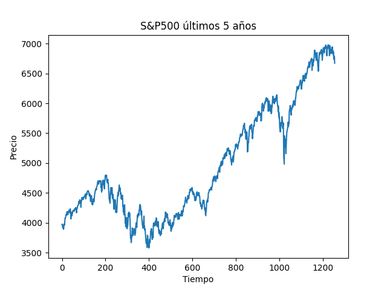
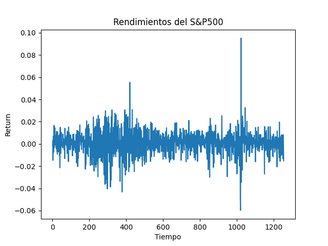

# Omega (12-03-2026) S&P500 Analysis using YFinance data
# Integrantes
* Sánchez Ramírez Diego Alberto 
* Dominguez Leon Jose Miguel

## 1. ¿Dependen los precios del S&P500 del precio anterior?

Sí, los precios del S&P500 parecen depender fuertemente del precio anterior.

En la gráfica del precio del índice se observa una trayectoria continua y suave, donde los cambios entre días consecutivos son relativamente pequeños comparados con el nivel total del índice. Esto sugiere que el precio actual $P_t$ está altamente relacionado con el precio del periodo anterior $P_{t-1}$
Matemáticamente esto puede modelarse como un random walk: $P_t= P_{t-1} +\epsilon_t$ donde $\epsilon_t$ es un término aleatorio que representa nueva información en el mercado.

Esto implica que $Corr(P_t, P_{t-1})\approx 1$

Por lo tanto, sí existe dependencia fuerte entre precios consecutivos.
## ¿Dependen los rendimientos del rendimiento anterior?

No parece haber una dependencia clara entre rendimientos consecutivos.

En la gráfica de rendimientos se observa que:

1. los valores oscilan alrededor de cero

2. no existe una tendencia clara

3. las variaciones positivas y negativas parecen aleatorias

Esto sugiere que $E[r_t|r_{t-1}] \approx 0$ con $E$ siendo el valor esperado o esperanza matematica y $r_t$ es el rendimiento en el tiempo $t$. Además $Corr(r_t, r_{t-1})\approx 0$ por lo que la información pasada no permite predecir rendimientos futuros.

## ¿Cómo intentarías predecir los rendimientos del S&P500?
Dado que los rendimientos parecen comportarse como una serie aproximadamente aleatoria, una forma simple de predecirlos sería usar el promedio histórico:

$\hat{r}= \dfrac{1}{n} \sum_{t=1}^{n}r_t$

## ¿Debería invertir todos mis ahorros en el S&P500 en lugar de CETES a 1 año?
No, aunque el índice muestra una tendencia creciente en los últimos cinco años, también presenta caídas importantes y volatilidad, como se observa en las fluctuaciones de la gráfica.

Por otro lado, los CETES ofrecen:
1. menor riesgo

2. rendimientos más estables

3. mayor certidumbre a corto plazo

Por lo tanto, desde un punto de vista financiero, sería más prudente diversificar la inversión entre activos de riesgo (acciones) y activos de renta fija (CETES).

## ¿Cambiaría tu respuesta si sólo invirtieras fondos discrecionales?
Sí.
Si el dinero invertido corresponde a fondos discrecionales, es decir, dinero cuya pérdida no afecta significativamente la estabilidad financiera personal, entonces invertir en el S&P500 podría ser más razonable.

## ¿Cambiarían las respuestas si el plazo fuera de 20 años en lugar de 1?
Sí, especialmente respecto a la decisión de inversión.

A largo plazo (por ejemplo 20 años), los mercados accionarios como el S&P 500 históricamente han mostrado rendimientos promedio mayores que los instrumentos de renta fija.